# 📱 Summarize AI

A beautiful, modern Android app that uses AI to summarize text content. Built with Jetpack Compose, Material 3, and clean architecture principles.

## ✨ Features

### 🎯 Core Functionality
- **AI Text Summarization** - Generate concise summaries from long text
- **Multiple Summary Lengths** - Short, Medium, and Detailed summaries
- **File Upload Support** - Upload and process PDF/DOC files
- **Real-time Processing** - Fast AI-powered text analysis

### 📱 User Experience
- **Beautiful UI** - Material 3 design with smooth animations
- **Intuitive Navigation** - Bottom tab navigation with 4 main sections
- **Search & Filter** - Find past summaries quickly
- **Copy & Share** - Easy sharing of summaries
- **Save Favorites** - Bookmark important summaries

### 🔧 Technical Features
- **Offline Support** - Local storage with Room database
- **Network Resilience** - Handles network issues gracefully
- **Performance Optimized** - Smooth scrolling and fast operations
- **Comprehensive Testing** - Unit, UI, and integration tests

## 🏗️ Architecture

### **MVVM + Repository Pattern**
```
Presentation Layer (UI)
    ↓
ViewModel (State Management)
    ↓
Repository (Data Abstraction)
    ↓
Data Sources (Local DB + Remote API)
```

### **System Architecture Diagram**

```mermaid
graph TB
    %% User Interface Layer
    subgraph "🎨 Presentation Layer"
        UI[UI Screens]
        Compose[Jetpack Compose]
        Material[Material 3]
        Navigation[Navigation]
    end

    %% State Management Layer
    subgraph "🧠 State Management"
        VM1[HomeViewModel]
        VM2[OutputViewModel]
        VM3[HistoryViewModel]
        VM4[SavedViewModel]
        StateFlow[StateFlow/Flow]
    end

    %% Business Logic Layer
    subgraph "🏢 Domain Layer"
        Repo[SummaryRepository]
        UseCases[Use Cases]
        Models[Domain Models]
    end

    %% Data Layer
    subgraph "💾 Data Layer"
        subgraph "Local Storage"
            Room[Room Database]
            DAO[SummaryDao]
            Entity[SummaryEntity]
        end
        
        subgraph "Remote API"
            Retrofit[Retrofit Client]
            API[SummarizerApi]
            Network[Network Utils]
        end
        
        subgraph "File Processing"
            PDF[PDFBox]
            Jsoup[Jsoup]
            TextExtract[Text Extraction]
        end
    end

    %% External Services
    subgraph "🌐 External Services"
        AIService[AI Summarization Service]
        FileSystem[File System]
    end

    %% Dependency Injection
    subgraph "🔧 Infrastructure"
        Hilt[Hilt DI]
        Coroutines[Coroutines]
        Utils[Utility Classes]
    end

    %% Styling
    classDef presentation fill:#e1f5fe,stroke:#01579b,stroke-width:2px,color:#000
    classDef state fill:#f3e5f5,stroke:#4a148c,stroke-width:2px,color:#000
    classDef domain fill:#e8f5e8,stroke:#1b5e20,stroke-width:2px,color:#000
    classDef data fill:#fff3e0,stroke:#e65100,stroke-width:2px,color:#000
    classDef external fill:#fce4ec,stroke:#880e4f,stroke-width:2px,color:#000
    classDef infrastructure fill:#f1f8e9,stroke:#33691e,stroke-width:2px,color:#000

    %% Apply styles
    class UI,Compose,Material,Navigation presentation
    class VM1,VM2,VM3,VM4,StateFlow state
    class Repo,UseCases,Models domain
    class Room,DAO,Entity,Retrofit,API,Network,PDF,Jsoup,TextExtract data
    class AIService,FileSystem external
    class Hilt,Coroutines,Utils infrastructure

    %% Connections
    UI --> VM1
    UI --> VM2
    UI --> VM3
    UI --> VM4
    
    VM1 --> StateFlow
    VM2 --> StateFlow
    VM3 --> StateFlow
    VM4 --> StateFlow
    
    VM1 --> Repo
    VM2 --> Repo
    VM3 --> Repo
    VM4 --> Repo
    
    Repo --> Room
    Repo --> Retrofit
    Repo --> TextExtract
    
    Room --> DAO
    DAO --> Entity
    
    Retrofit --> API
    API --> AIService
    
    TextExtract --> PDF
    TextExtract --> Jsoup
    TextExtract --> FileSystem
    
    Hilt --> VM1
    Hilt --> VM2
    Hilt --> VM3
    Hilt --> VM4
    Hilt --> Repo
    Hilt --> Room
    Hilt --> Retrofit
    
    Coroutines --> VM1
    Coroutines --> VM2
    Coroutines --> VM3
    Coroutines --> VM4
    Coroutines --> Repo
```




### **Key Components**
- **Jetpack Compose** - Modern declarative UI
- **Material 3** - Latest design system
- **Hilt** - Dependency injection
- **Room** - Local database
- **Retrofit** - API communication
- **Coroutines & Flow** - Asynchronous programming

## 🚀 Getting Started

### Prerequisites
- Android Studio Arctic Fox or later
- Android SDK 24+
- Kotlin 1.9+
- Local AI API service running on `http://127.0.0.1:8000`

### Installation

1. **Clone the repository**
   ```bash
   git clone https://github.com/MingLu0/SummarizeAI.git
   cd SummarizeAI
   ```

2. **Setup local.properties**
   ```bash
   cp local.properties.template local.properties
   # Edit local.properties and add your Android SDK path
   ```

3. **Open in Android Studio**
   - Open Android Studio
   - Select "Open an existing project"
   - Navigate to the cloned repository
   - Wait for Gradle sync to complete

4. **Setup AI API Service**
   - Ensure your local AI service is running on `http://127.0.0.1:8000`
   - The service should have a POST endpoint at `/api/v1/summarize/`

5. **Run the app**
   - Connect an Android device or start an emulator
   - Click the "Run" button in Android Studio

## 📋 API Integration

### Expected API Format

**Request:**
```json
POST /api/v1/summarize/
{
  "text": "Your text to summarize...",
  "max_tokens": 256,
  "prompt": "Summarize the following text concisely:"
}
```

**Response:**
```json
{
  "summary": "Generated summary text...",
  "model": "model-name",
  "tokens_used": 150,
  "latency_ms": 500.0
}
```

## 🧪 Testing

### Run Tests
```bash
# Unit tests
./gradlew test

# UI tests
./gradlew connectedAndroidTest

# All tests
./gradlew check
```

### Test Coverage
- **Unit Tests** - ViewModels, Repository, Utils
- **UI Tests** - Critical user flows
- **Integration Tests** - API and database operations
- **Performance Tests** - Large datasets and concurrent operations

## 📱 Screenshots

### Main Screens
- **Splash Screen** - Beautiful animated loading
- **Welcome Screen** - Onboarding with app introduction
- **Home Screen** - Text input and file upload
- **Output Screen** - Summary display with actions
- **History Screen** - Past summaries with search
- **Saved Screen** - Bookmarked summaries
- **Settings Screen** - App preferences

## 🔧 Configuration

### Environment Variables
- `BASE_URL` - API service URL (default: `http://127.0.0.1:8000`)
- `TIMEOUT_SECONDS` - Request timeout (default: 30)

### Build Variants
- **Debug** - Development build with logging
- **Release** - Production build optimized for performance

## 📦 Dependencies

### Core Libraries
- **Jetpack Compose** - UI framework
- **Material 3** - Design system
- **Hilt** - Dependency injection
- **Room** - Local database
- **Retrofit** - API client
- **Coroutines** - Asynchronous programming

### Testing Libraries
- **JUnit** - Unit testing
- **MockK** - Mocking framework
- **Espresso** - UI testing
- **Compose Testing** - Compose UI testing

## 🚀 Deployment

### Release Build
```bash
# Generate signed APK
./gradlew assembleRelease

# Generate App Bundle
./gradlew bundleRelease
```

### Play Store Submission
1. Generate signed App Bundle
2. Upload to Google Play Console
3. Fill in store listing details
4. Submit for review

## 🤝 Contributing

1. Fork the repository
2. Create a feature branch
3. Make your changes
4. Add tests for new functionality
5. Submit a pull request

## 📄 License

This project is licensed under the MIT License - see the [LICENSE](LICENSE) file for details.

## 🙏 Acknowledgments

- **Material 3** - Google's design system
- **Jetpack Compose** - Modern Android UI toolkit
- **Room** - Local database solution
- **Retrofit** - Type-safe HTTP client

## 📞 Support

For support, email purringlab@gmail.com or create an issue in this repository.

---

**Built with ❤️ using modern Android development practices**