# 📱 Summarize AI

A beautiful, modern Android app that uses AI to summarize text content. Built with Jetpack Compose, Material 3, and clean architecture principles.

## ✨ Features

### 🎯 Core Functionality
- **AI Text Summarization** - Generate concise summaries from long text
- **Multiple Summary Lengths** - Short, Medium, and Detailed summaries
- **File Upload Support** - Upload and process PDF/DOC files
- **Real-time Streaming** - Live streaming summaries with progressive updates
- **Web Content Extraction** - Extract and summarize content from shared URLs
- **Smart Content Processing** - Intelligent text analysis and processing

### 📱 User Experience
- **Beautiful UI** - Material 3 design with smooth animations
- **Intuitive Navigation** - Bottom tab navigation with clean architecture
- **Search & Filter** - Find past summaries quickly
- **Copy & Share** - Easy sharing of summaries
- **Save Favorites** - Bookmark important summaries
- **URL Sharing Support** - Share URLs from other apps for instant summarization
- **Streaming Toggle** - Choose between traditional and streaming summarization

### 🔧 Technical Features
- **Offline Support** - Local storage with Room database
- **Network Resilience** - Handles network issues gracefully
- **Performance Optimized** - Smooth scrolling and fast operations
- **Clean Architecture** - Maintainable, testable, and scalable code structure
- **Unidirectional Data Flow** - Predictable state management
- **Comprehensive Testing** - Unit, UI, and integration tests

## 🏗️ Architecture

### **Clean Architecture with Scaffold Pattern**

The app follows a **Clean Architecture with Scaffold Pattern** that ensures maintainable, testable, and scalable code. This architecture implements a unidirectional data flow with centralized state management.

#### **Core Architecture Principles**

1. **Single Source of Truth** - All app state is observed at the MainActivity level
2. **Unidirectional Data Flow** - State flows DOWN, Events flow UP
3. **Pure Composables** - Screen composables have no direct ViewModel dependencies
4. **Centralized Navigation** - All navigation logic is handled in MainActivity

#### **Architecture Flow**
```
MainActivity (Entry Point)
├── Observe ALL ViewModels
├── Collect ALL State Flows  
├── Handle ALL Navigation Logic
└── AppScaffold
    ├── Material3 Scaffold Wrapper
    └── SummarizeAINavHost
        ├── MainScreenWithBottomNavigation (Inner Scaffold)
        │   └── NavHost with Screen Composables
        └── Other Navigation Routes
```

#### **MVVM + Repository Pattern**
```
Presentation Layer (UI)
    ↓
ViewModel (State Management)
    ↓
Repository (Data Abstraction)
    ↓
Data Sources (Local DB + Remote API)
```

### **System Architecture Diagram**

```mermaid
graph TB
    %% User Interface Layer
    subgraph "🎨 Presentation Layer"
        UI[UI Screens]
        Compose[Jetpack Compose]
        Material[Material 3]
        Navigation[Navigation]
    end

    %% State Management Layer
    subgraph "🧠 State Management"
        VM1[HomeViewModel]
        VM2[OutputViewModel]
        VM3[StreamingOutputViewModel]
        VM4[HistoryViewModel]
        VM5[SavedViewModel]
        VM6[SettingsViewModel]
        VM7[WebContentViewModel]
        VM8[WebPreviewViewModel]
        StateFlow[StateFlow/Flow]
    end

    %% Business Logic Layer
    subgraph "🏢 Domain Layer"
        Repo[SummaryRepository]
        UseCases[Use Cases]
        Models[Domain Models]
    end

    %% Data Layer
    subgraph "💾 Data Layer"
        subgraph "Local Storage"
            Room[Room Database]
            DAO[SummaryDao]
            Entity[SummaryEntity]
        end
        
        subgraph "Remote API"
            Retrofit[Retrofit Client]
            API[AI Service API]
            Network[Network Utils]
        end
        
        subgraph "File Processing"
            PDF[PDFBox]
            Jsoup[Jsoup]
            TextExtract[Text Extraction]
        end
    end

    %% External Services
    subgraph "🌐 External Services"
        AIService[AI Service]
        FileSystem[File System]
    end

    %% Dependency Injection
    subgraph "🔧 Infrastructure"
        Hilt[Hilt DI]
        Coroutines[Coroutines]
        Utils[Utility Classes]
    end

    %% Styling
    classDef presentation fill:#e1f5fe,stroke:#01579b,stroke-width:2px,color:#000
    classDef state fill:#f3e5f5,stroke:#4a148c,stroke-width:2px,color:#000
    classDef domain fill:#e8f5e8,stroke:#1b5e20,stroke-width:2px,color:#000
    classDef data fill:#fff3e0,stroke:#e65100,stroke-width:2px,color:#000
    classDef external fill:#fce4ec,stroke:#880e4f,stroke-width:2px,color:#000
    classDef infrastructure fill:#f1f8e9,stroke:#33691e,stroke-width:2px,color:#000

    %% Apply styles
    class UI,Compose,Material,Navigation presentation
    class VM1,VM2,VM3,VM4,VM5,VM6,VM7,VM8,StateFlow state
    class Repo,UseCases,Models domain
    class Room,DAO,Entity,Retrofit,API,Network,PDF,Jsoup,TextExtract data
    class AIService,FileSystem external
    class Hilt,Coroutines,Utils infrastructure

    %% Connections
    UI --> VM1
    UI --> VM2
    UI --> VM3
    UI --> VM4
    UI --> VM5
    UI --> VM6
    UI --> VM7
    UI --> VM8
    
    VM1 --> StateFlow
    VM2 --> StateFlow
    VM3 --> StateFlow
    VM4 --> StateFlow
    VM5 --> StateFlow
    VM6 --> StateFlow
    VM7 --> StateFlow
    VM8 --> StateFlow
    
    VM1 --> Repo
    VM2 --> Repo
    VM3 --> Repo
    VM4 --> Repo
    VM5 --> Repo
    VM6 --> Repo
    VM7 --> Repo
    VM8 --> Repo
    
    Repo --> Room
    Repo --> Retrofit
    Repo --> TextExtract
    
    Room --> DAO
    DAO --> Entity
    
    Retrofit --> API
    API --> AIService
    
    TextExtract --> PDF
    TextExtract --> Jsoup
    TextExtract --> FileSystem
    
    Hilt --> VM1
    Hilt --> VM2
    Hilt --> VM3
    Hilt --> VM4
    Hilt --> VM5
    Hilt --> VM6
    Hilt --> VM7
    Hilt --> VM8
    Hilt --> Repo
    Hilt --> Room
    Hilt --> Retrofit
    
    Coroutines --> VM1
    Coroutines --> VM2
    Coroutines --> VM3
    Coroutines --> VM4
    Coroutines --> VM5
    Coroutines --> VM6
    Coroutines --> VM7
    Coroutines --> VM8
    Coroutines --> Repo
```




### **Key Components**

#### **Architecture Components**
- **AppScaffold** - Material3 scaffold wrapper for consistent navigation structure
- **SummarizeAINavHost** - Centralized navigation host with state management
- **MainScreenWithBottomNavigation** - Inner scaffold for bottom tab navigation
- **Clean Architecture Pattern** - Unidirectional data flow with centralized state

#### **Core Libraries**
- **Jetpack Compose** - Modern declarative UI
- **Material 3** - Latest design system
- **Hilt** - Dependency injection
- **Room** - Local database
- **Retrofit** - API communication
- **Coroutines & Flow** - Asynchronous programming

#### **ViewModels (8 Total)**
- **HomeViewModel** - Text input and summarization logic
- **OutputViewModel** - Summary display and actions
- **StreamingOutputViewModel** - Real-time streaming summaries
- **HistoryViewModel** - Past summaries management
- **SavedViewModel** - Bookmarked summaries
- **SettingsViewModel** - App preferences and configuration
- **WebContentViewModel** - Web content extraction from shared URLs
- **WebPreviewViewModel** - Web content preview functionality

## 🏛️ Clean Architecture Implementation

### **Architecture Benefits**

#### **🎯 Maintainability**
- Single source of truth for all app state
- Clear separation of concerns
- Predictable state flow
- Centralized navigation logic

#### **🧪 Testability**
- Pure composables are easy to test
- Mock state and callbacks for unit tests
- No ViewModel dependencies in UI tests
- Isolated business logic testing

#### **🔄 Reusability**
- Screens can be reused in different contexts
- Preview composables work easily
- Components are more modular
- State and callbacks are explicit

#### **🚀 Performance**
- Optimized state collection at top level
- Reduced recomposition
- Better memory management
- Efficient navigation handling

### **Implementation Pattern**

#### **MainActivity Structure**
```kotlin
@AndroidEntryPoint
class MainActivity : ComponentActivity() {
    override fun onCreate(savedInstanceState: Bundle?) {
        super.onCreate(savedInstanceState)
        setContent {
            SummarizeAITheme {
                // 🔑 OBSERVE ALL VIEWMODELS AT TOP LEVEL
                val homeViewModel: HomeViewModel = hiltViewModel()
                val settingsViewModel: SettingsViewModel = hiltViewModel()
                // ... other ViewModels
                
                // 🔑 COLLECT ALL STATE FLOWS
                val homeUiState by homeViewModel.uiState.collectAsStateWithLifecycle()
                val isStreamingEnabled by settingsViewModel.isStreamingEnabled.collectAsStateWithLifecycle()
                // ... other states
                
                // 🔑 HANDLE ALL NAVIGATION LOGIC HERE
                LaunchedEffect(homeUiState) {
                    if (homeUiState.shouldNavigateToStreaming) {
                        navController.navigate(Screen.StreamingOutput.createRoute(homeUiState.textInput))
                        homeViewModel.clearNavigationFlags()
                    }
                }
                
                // 🔑 PASS ALL STATE AND CALLBACKS DOWN
                AppScaffold(
                    navController = navController,
                    homeUiState = homeUiState,
                    isStreamingEnabled = isStreamingEnabled,
                    // ... other states and ViewModels
                )
            }
        }
    }
}
```

#### **Screen Composable Pattern**
```kotlin
// ✅ CORRECT - Pure Composable with State and Callbacks
@Composable
fun HomeScreen(
    uiState: HomeUiState,
    extractedContent: String? = null,
    onUpdateTextInput: (String) -> Unit,
    onSummarizeText: () -> Unit,
    onUploadFile: (Uri) -> Unit
) {
    // Use state directly, call callbacks for events
    BasicTextField(
        value = uiState.textInput,
        onValueChange = onUpdateTextInput
    )
    
    Button(
        onClick = onSummarizeText,
        enabled = uiState.isSummarizeEnabled && !uiState.isLoading
    ) {
        Text("Summarize")
    }
}
```

### **Key Rules**

#### **✅ DO's**
1. **Observe ViewModels at MainActivity Level**
2. **Pass State and Callbacks Down**
3. **Handle Navigation in MainActivity**
4. **Use Pure Composables**

#### **❌ DON'Ts**
1. **Don't Use ViewModels in Screen Composables**
2. **Don't Handle Navigation in Screens**
3. **Don't Scatter State Management**

For detailed implementation guidelines, see [CLEAN_ARCHITECTURE_SCAFFOLD_PATTERN.md](CLEAN_ARCHITECTURE_SCAFFOLD_PATTERN.md).

### **Project Structure**

```
app/src/main/java/com/summarizeai/
├── MainActivity.kt                    # Entry point with ViewModel observation
├── ui/
│   ├── navigation/
│   │   ├── AppScaffold.kt            # Material3 scaffold wrapper
│   │   └── SummarizeAINavHost.kt     # Centralized navigation host
│   └── screens/
│       ├── home/HomeScreen.kt        # Text input and file upload
│       ├── output/
│       │   ├── OutputScreen.kt       # Traditional summary display
│       │   └── StreamingOutputScreen.kt # Real-time streaming display
│       ├── history/HistoryScreen.kt  # Past summaries
│       ├── saved/SavedScreen.kt      # Bookmarked summaries
│       ├── settings/SettingsScreen.kt # App preferences
│       ├── webpreview/WebPreviewScreen.kt # Web content preview
│       ├── splash/SplashScreen.kt    # App loading screen
│       └── welcome/WelcomeScreen.kt  # Onboarding screen
├── presentation/
│   └── viewmodel/                    # 8 ViewModels for state management
│       ├── HomeViewModel.kt
│       ├── OutputViewModel.kt
│       ├── StreamingOutputViewModel.kt
│       ├── HistoryViewModel.kt
│       ├── SavedViewModel.kt
│       ├── SettingsViewModel.kt
│       ├── WebContentViewModel.kt
│       └── WebPreviewViewModel.kt
├── data/
│   ├── repository/                   # Data abstraction layer
│   ├── remote/                       # API and network layer
│   └── local/                        # Room database layer
└── domain/                           # Business logic and models
```

## 🚀 Getting Started

### Prerequisites
- Android Studio Hedgehog (2023.1.1) or later
- Android SDK 24+ (compileSdk 34)
- Kotlin 1.9.22+
- Java 17

### Installation

1. **Clone the repository**
   ```bash
   git clone https://github.com/MingLu0/SummarizeAI.git
   cd SummarizeAI
   ```

2. **Setup local.properties**
   ```bash
   cp local.properties.template local.properties
   # Edit local.properties and add your Android SDK path
   ```

3. **Open in Android Studio**
   - Open Android Studio
   - Select "Open an existing project"
   - Navigate to the cloned repository
   - Wait for Gradle sync to complete

4. **Run the app**
   - Connect an Android device or start an emulator
   - Click the "Run" button in Android Studio

## 📋 AI Integration

The app integrates with AI services for text summarization. The specific AI service and API endpoints are configured within the app and may vary based on the deployment configuration.

## 🧪 Testing

### Test Architecture Overview

The Summarize AI app follows a comprehensive testing strategy with multiple layers of testing to ensure reliability, performance, and user experience quality.

#### **Testing Pyramid Structure**
```
    🔺 E2E Tests (2 tests)
   🔺🔺 Integration Tests (1 test)  
  🔺🔺🔺 Unit Tests (2 tests)
 🔺🔺🔺🔺 Component Tests (4 tests)
```

### **Test Categories & Coverage**

#### **1. Unit Tests (2 tests)**
**Location**: `app/src/test/java/`

- **`WebContentExtractorTest.kt`** - Tests web content extraction functionality
  - URL validation (HTTP/HTTPS only)
  - Network availability checks
  - Error handling for invalid URLs
  - Network connectivity scenarios

- **`PDFFixBasicTest.kt`** - Tests PDF processing error handling
  - User-friendly error message validation
  - PDF crash prevention mechanisms
  - Error scenario coverage (glyph list errors, password protection, corruption)
  - Comprehensive error handling verification

#### **2. UI Component Tests (4 tests)**
**Location**: `app/src/androidTest/java/com/summarizeai/ui/`

- **`HomeScreenTest.kt`** - Home screen functionality
  - Element visibility verification
  - Button state management (enabled/disabled)
  - Text input validation
  - Upload button functionality

- **`OutputScreenTest.kt`** - Output screen behavior
  - Summary display elements
  - Tab selection (Short, Medium, Detailed)
  - Action button functionality (Copy, Save, Share)
  - UI interaction validation

- **`HistoryScreenTest.kt`** - History screen features
  - Empty state display
  - Search functionality
  - Element visibility
  - User interaction testing

- **`NavigationFlowTest.kt`** - Navigation behavior
  - Back button navigation
  - Home button navigation
  - Bottom tab navigation
  - Screen transition validation

#### **3. Integration Tests (1 test)**
**Location**: `app/src/androidTest/java/com/summarizeai/ui/`

- **`NavigationIntegrationTest.kt`** - End-to-end navigation flow
  - Complete user journey from Home to Output
  - Bottom tab navigation across all screens
  - Navigation state persistence
  - Cross-screen interaction testing

### **Test Execution Commands**

```bash
# Run all unit tests
./gradlew test

# Run all UI and integration tests
./gradlew connectedAndroidTest

# Run specific test categories
./gradlew testDebugUnitTest          # Unit tests only
./gradlew connectedDebugAndroidTest  # UI tests only

# Run all tests with coverage
./gradlew check

# Run tests with detailed output
./gradlew test --info
```

### **Test Quality Metrics**

#### **Coverage Areas**
- ✅ **UI Components** - All major screens tested
- ✅ **Navigation Flow** - Complete user journey coverage
- ✅ **Error Handling** - PDF processing and network errors
- ✅ **User Interactions** - Button states, text input, navigation
- ✅ **Edge Cases** - Empty states, network failures, invalid inputs

#### **Test Quality Indicators**
- **7 Total Test Files** - Comprehensive coverage across layers
- **Mockito Integration** - Proper mocking for unit tests
- **Compose Testing** - Modern UI testing with Jetpack Compose
- **Coroutines Testing** - Async operation testing with `runTest`
- **Error Scenario Coverage** - Specific crash prevention testing

### **Testing Best Practices Implemented**

#### **1. Test Structure**
- **Arrange-Act-Assert** pattern consistently used
- **Descriptive test names** with clear intent
- **Proper setup and teardown** with `@Before` methods
- **Mocking strategy** for external dependencies

#### **2. UI Testing**
- **Compose Test Rules** for UI component testing
- **Semantic node testing** for accessibility
- **User interaction simulation** (clicks, text input)
- **State validation** (enabled/disabled, visibility)

#### **3. Integration Testing**
- **End-to-end user flows** testing
- **Navigation state validation**
- **Cross-component interaction** testing
- **Real device/emulator testing**

### **Test Data & Mocking**

#### **Mock Objects Used**
- `NetworkUtils` - Network connectivity simulation
- `WebContentExtractor` - Web content processing
- Navigation callbacks and state management

#### **Test Scenarios Covered**
- **Happy Path** - Normal user interactions
- **Error Scenarios** - Network failures, invalid inputs
- **Edge Cases** - Empty states, boundary conditions
- **Performance** - Large data handling, concurrent operations

### **Continuous Integration**

#### **Automated Testing Pipeline**
```bash
# Pre-commit testing
./gradlew check

# CI/CD pipeline
./gradlew test connectedAndroidTest

# Release validation
./gradlew testReleaseUnitTest
```

#### **Test Reports**
- **Unit Test Results** - Available in `app/build/reports/tests/`
- **Coverage Reports** - Generated with `./gradlew jacocoTestReport`
- **UI Test Screenshots** - Captured during test failures

### **Future Testing Enhancements**

#### **Planned Additions**
- [ ] **Repository Tests** - Data layer testing with Room database
- [ ] **ViewModel Tests** - State management and business logic
- [ ] **AI Service Integration Tests** - Network layer testing
- [ ] **Performance Tests** - Large dataset handling
- [ ] **Accessibility Tests** - Screen reader and accessibility compliance

#### **Test Coverage Goals**
- **Target**: 80%+ code coverage
- **Focus Areas**: Business logic, data processing, error handling
- **Automation**: Full CI/CD integration with automated test execution

## 📱 Screenshots

### Main Screens
- **Splash Screen** - Beautiful animated loading with app branding
- **Welcome Screen** - Onboarding with app introduction and gradient design
- **Home Screen** - Text input, file upload, and summarization trigger with web content support
- **Loading Screen** - Animated progress during AI processing
- **Output Screen** - Summary display with multiple length options and actions
- **Streaming Output Screen** - Real-time streaming summary display with live updates
- **History Screen** - Past summaries with search and filtering
- **Saved Screen** - Bookmarked summaries with management options
- **Settings Screen** - App preferences and configuration with streaming toggle
- **Web Preview Screen** - Web content extraction and preview functionality

## 🔧 Configuration

### Environment Variables
- `BASE_URL` - AI service URL (configured within the app)
- `TIMEOUT_SECONDS` - Request timeout (default: 30)

### Build Variants
- **Debug** - Development build with logging and `.debug` suffix
- **Release** - Production build optimized for performance with ProGuard

## 📦 Dependencies

### Core Libraries
- **Jetpack Compose BOM 2024.02.00** - UI framework
- **Material 3** - Design system
- **Hilt 2.48** - Dependency injection
- **Room 2.6.1** - Local database
- **Retrofit 2.9.0** - API client
- **Coroutines** - Asynchronous programming
- **PDFBox 2.0.27.0** - PDF processing
- **Jsoup 1.17.2** - Web content extraction
- **Navigation Compose** - Type-safe navigation
- **Lifecycle Compose** - Lifecycle-aware composables

### Testing Libraries
- **JUnit 4.13.2** - Unit testing
- **Mockito Kotlin 5.2.1** - Mocking framework
- **Espresso 3.5.1** - UI testing
- **Compose Testing** - Compose UI testing
- **Coroutines Test 1.7.3** - Async testing

## 🚀 Deployment

### Release Build
```bash
# Generate signed APK
./gradlew assembleRelease

# Generate App Bundle
./gradlew bundleRelease
```

### Play Store Submission
1. Generate signed App Bundle
2. Upload to Google Play Console
3. Fill in store listing details
4. Submit for review

## 🤝 Contributing

1. Fork the repository
2. Create a feature branch
3. Make your changes
4. Add tests for new functionality
5. Submit a pull request

## 📄 License

This project is licensed under the MIT License - see the [LICENSE](LICENSE) file for details.

## 🙏 Acknowledgments

- **Material 3** - Google's design system
- **Jetpack Compose** - Modern Android UI toolkit
- **Room** - Local database solution
- **Retrofit** - Type-safe HTTP client
- **Clean Architecture** - Robert C. Martin's architectural principles
- **MVVM Pattern** - Microsoft's architectural pattern
- **Hilt** - Google's dependency injection framework

## 📞 Support

For support, email purringlab@gmail.com or create an issue in this repository.

---

**Built with ❤️ using modern Android development practices**